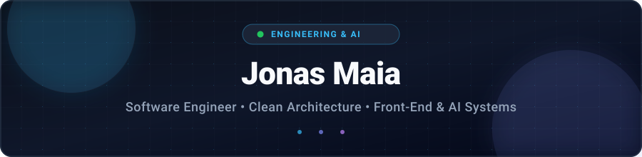

<!-- HEADER BANNER -->

  

<!-- TYPING ANIMATION -->

  

  <em>Engenheiro de Software com foco em Clean Architecture, interfaces modernas e sistemas escaláveis impulsionados por Inteligência Artificial.</em>

---

### 👨‍💻 Sobre Mim

- 🏗️ **Arquitetura & Clean Code**: Desenvolvimento orientado a princípios SOLID, desacoplamento de camadas, alta manutenibilidade e excelência técnica.
- 🎨 **Front-End de Alta Performance**: Criação de aplicações web interativas, acessíveis e responsivas utilizando React, Next.js, TypeScript e ecossistema CSS moderno.
- ⚡ **FullStack & Integrações de APIs**: Construção e consumo de APIs robustas (REST e GraphQL), comunicação entre serviços e arquitetura em nuvem.
- 🤖 **Workflows Agênticos & IA**: Integração de modelos de linguagem (OpenAI, Claude, Gemini) e automação inteligente aplicados a produtos reais.

---

### 🚀 Arsenal Tecnológico

  
<b>🎨 Front-End & UI</b>

   
  

    
    
    
    
    
    
    
    
    
  

 

  
<b>⚡ Backend & APIs</b>

   
  

    
    
    
    
    
    
  

 

  
<b>🤖 Inteligência Artificial & LLMs</b>

   
  

    
    
    
  

 

  
<b>🗄️ Bancos de Dados & DevOps</b>

   
  

    
    
    
    
    
  

---

### 📊 Estatísticas do GitHub

  
  

  

---

### 🐍 Histórico de Contribuições

  <picture>
    <source media="(prefers-color-scheme: dark)" srcset="https://raw.githubusercontent.com/jonasmaia-newtour/jonasmaia-newtour/output/github-contribution-grid-snake-dark.svg">
    <source media="(prefers-color-scheme: light)" srcset="https://raw.githubusercontent.com/jonasmaia-newtour/jonasmaia-newtour/output/github-contribution-grid-snake.svg">
    
  </picture>

